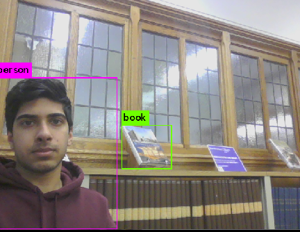
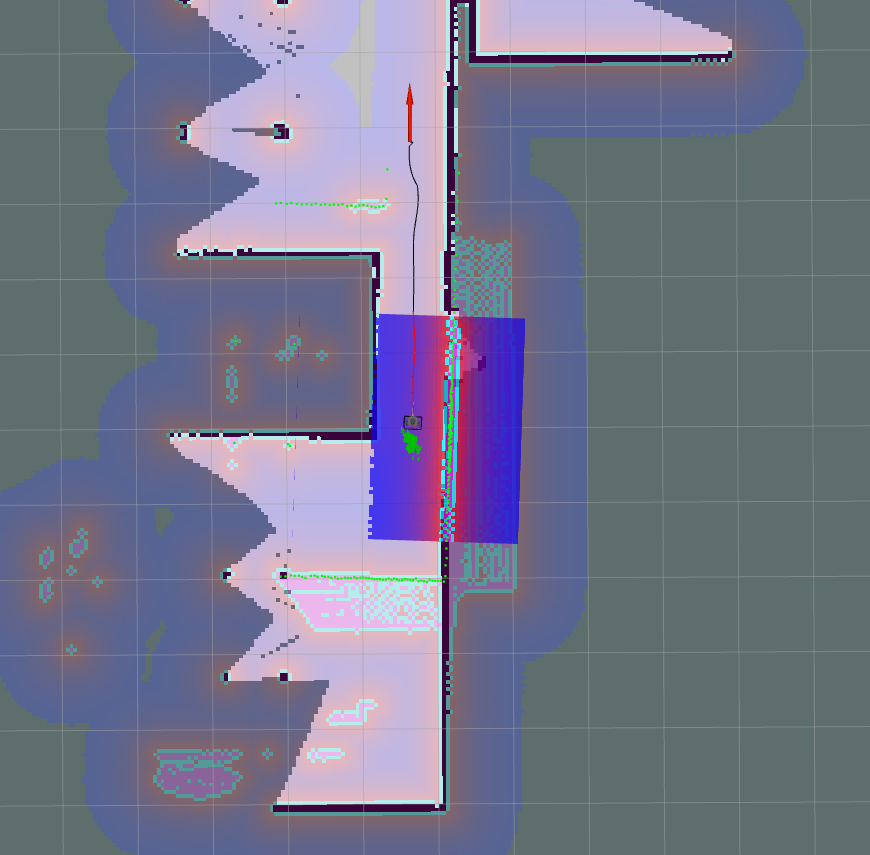
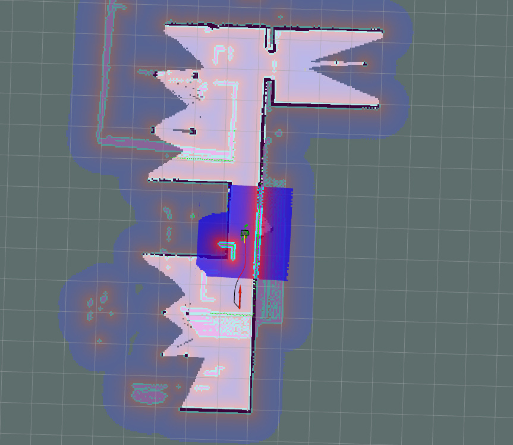

This file describes all nodes and launchfiles used within the package homework4, as well as any expected results. 

Note: I included a .rosinstall file because I made some minor, but important, changes to the darknet_ros package. Changes I made are listed in the sections below. 

**Launch Files**
web.launch: This is the launch file created for the Image Processing section of homework4 4. This launch file contains the node for the linux webcam, rviz, and the yolo_v3 launch file. The yolo_v3 launch file was also changed within the darknet_ros package because the default camera needed to be adjusted. Running this launch file will launch rviz and a pop up window from rviz, which will display images from the webcam along with object detection/labeling from the yolo_v3 launch file.

command to launch: roslaunch homework4 turtlebot3_load.launch 

 Screenshot of example image when running this launch file:
 
 
 turtlebot3_load.launch: Loads turtlebot3 in the house environment, loads rviz and visualizes it's laser scan, starts a teleoperation node, and gmapping. This launch file is comprised of embedded launch files within the turtlebot3 packages. In addition to the packages, the slam gmapping was installed on the system prior to launching file. 
 
 command to launch this launch file: roslaunch homework4 turtlebot3_load.launch slam_methods:=gmapping

Robot was manually driven to gmap the map using the following commands:
export TURTLEBOT3_MODEL=burger
roslaunch turtlebot3_teleop turtlebot3_teleop_key.launch

turtlebot3_localize.launch: Launch file is derived from the turtlebot3_navigation launch file, which loads rviz, the map server, amcl, move_base launch file, and turtlebot3 burger robot. The amcl is resonsible for localizing the robot and the move_base launch file part of the move_base package responsible for moving the turtlebot3 to a goal via pose messages. 

Command to run this:
roslaunch homework4 turtlebot3_localize.launch 

turtlebot3_localize_gazebo.launch: This launch file is identical to turtlebot3_localize.launch except that the gazebo world with additional obstacles is loaded.

Command to run this:
roslaunch homework4 turtlebot3_localize_gazebo.launch

Screenshots of navigation plan being executed and turtlebot3 moving around obstacles in rviz:

 
 
 
 
 
auto_drivemap.launch: Performs the same functions as turtlebot3_load.launch, but also loads the move_base launch file, in order to issue pose commands to turtlebot3, and launches the created node auto_nav, which explores its environment autonomously while gmapping. 

Command to run this:
roslaunch homework4 auto_drivemap.launch

**Nodes**
*auto_nav*
goal: autonomously drive the robot while gmapping.
strategy: to issue commands allowing the robot to move, the move_base package is used to issue x/y poses. This is coupled with the actionlib pakage, which will allow the node to set goals of certain waypoints and communicate when a goal is reached. Poses will be manually set and each time the turtlebot3 reaches a waypoint, the turtlebot will then follow the navigation path to the next waypoint. This will be repeated until the turtlebot3 travels throughout the map. 
 
